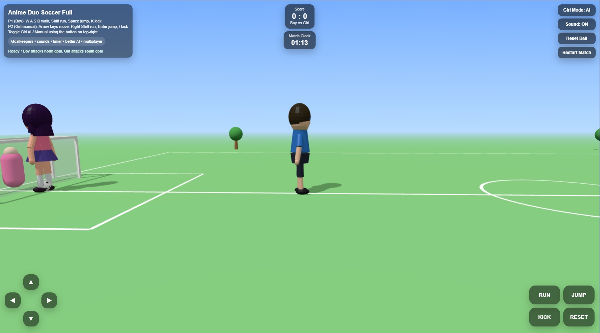

# Anime Duo Soccer Full



This version adds all requested features:

1. Goalkeepers
2. Sound effects
3. Timer / match clock
4. Better girl AI
5. Multiplayer controls

## How to run

1. Extract the ZIP.
2. Open terminal / command prompt in this folder.
3. Run:

```bash
python -m http.server 8000
```

4. Open:

```text
http://localhost:8000
```

## Player 1 (Boy)

- W A S D = move
- Shift = run
- Space = jump
- K = kick

## Player 2 (Girl manual mode)

- Arrow keys = move
- Right Shift = run (Shift also works as fallback)
- Enter = jump
- / = kick

## UI

- Girl Mode button toggles AI / Manual
- Sound button toggles sound effects
- Reset Ball resets only the ball
- Restart Match resets score, timer, players, goalkeepers, and ball

## Mobile

- On-screen controls are included for Player 1
- Mobile buttons: RUN / JUMP / KICK / RESET

## Gameplay

- Boy attacks the north goal (top / negative Z)
- Girl attacks the south goal (bottom / positive Z)
- Match length: 90 seconds
- At time up, the game announces winner or draw
